# .github do trabalho

Figura 1. Mapa de trajetos do AGV

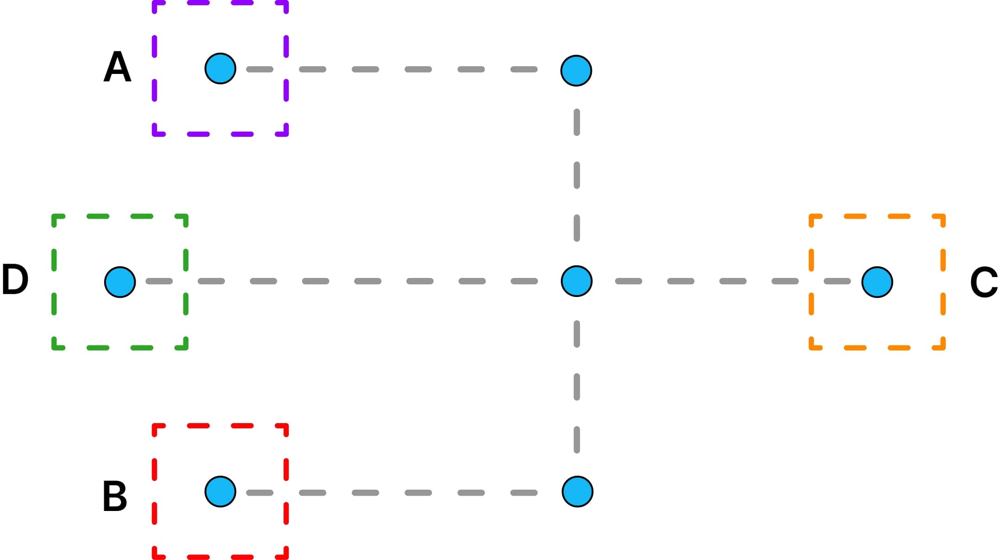

#

Figura 2. Diagrama de domínio

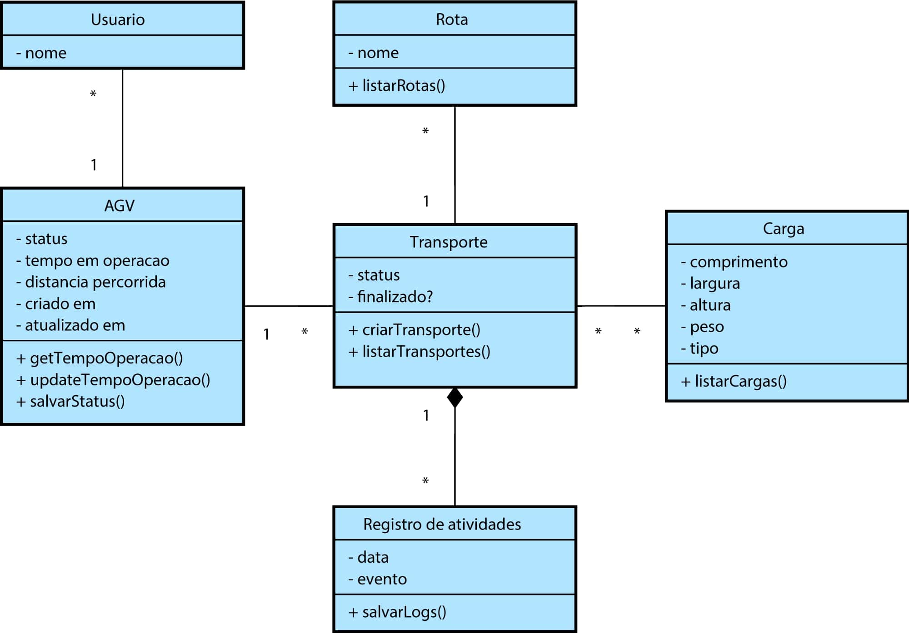

#

Figura 3. Diagrama de máquina de estado

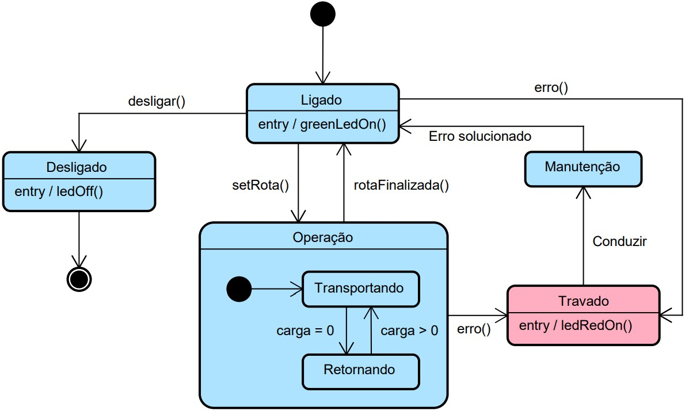

#

Figura 4. Desenho tridimensional do AGV

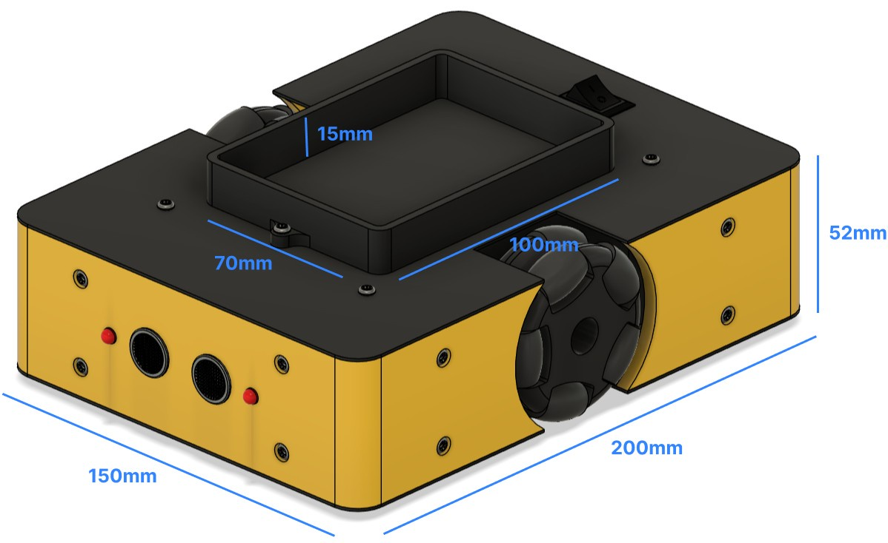

#

Figura 5. Processo de fabricação das peça

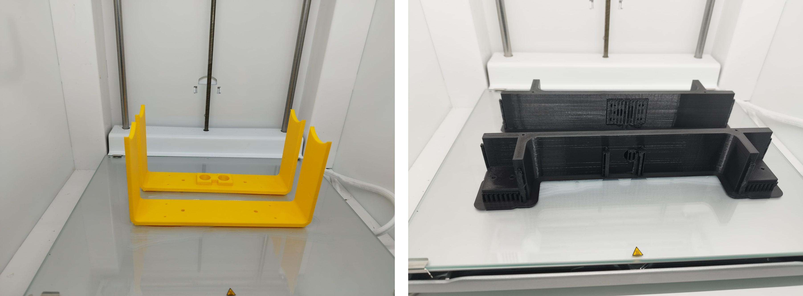

#

Figura 6. Esquema Eletrônico

#

Figura 7. Versão final do protótipo do AGV

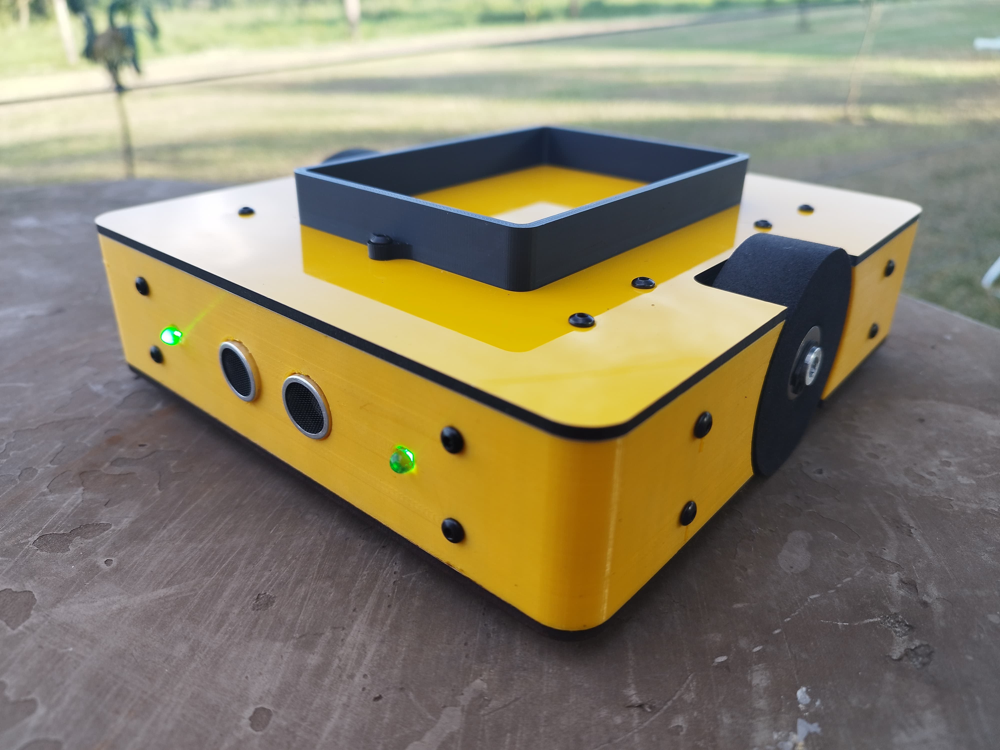

#

Figura 8. AGV realizando o percurso

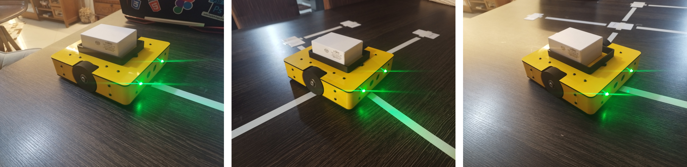

#

Figura 9. Testes de segurança com o sensor ultrassônico

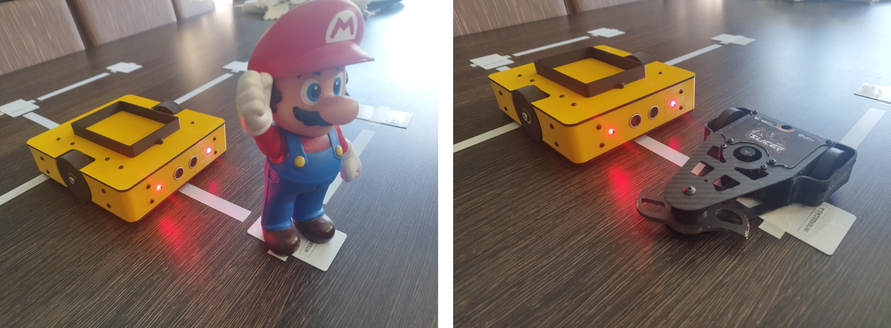

#

Figura 10. Tela de Visão Geral do aplicativo web

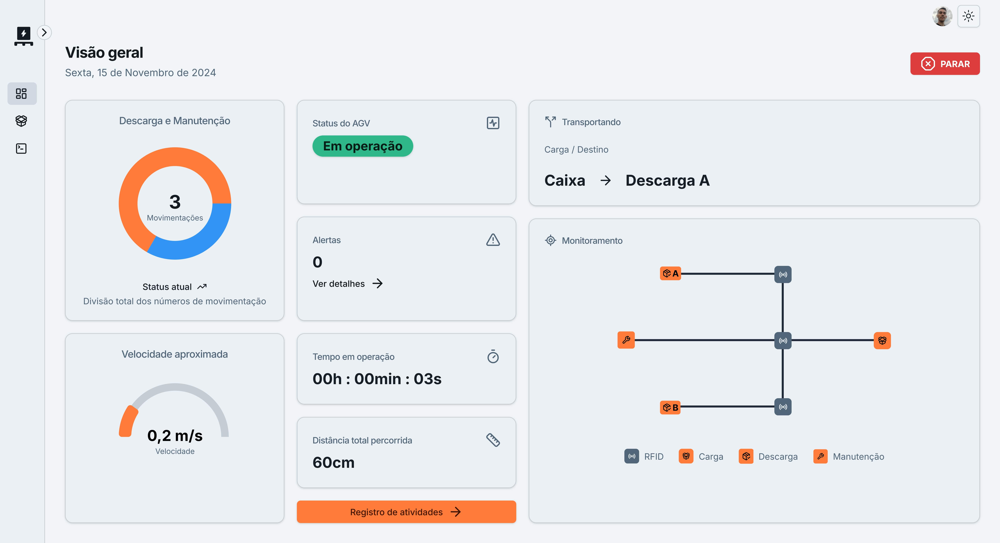

#

Figura 11. Tela de Gestão de Transporte do aplicativo web

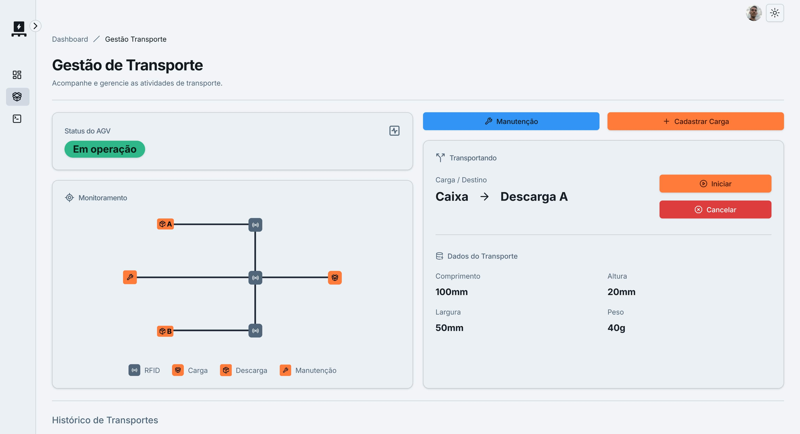

#

Figura 12. Tela de Criação de Carga do aplicativo web

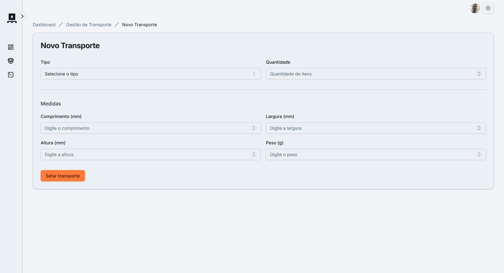

#

Figura 13. Tela de Seleção de Transporte do aplicativo web

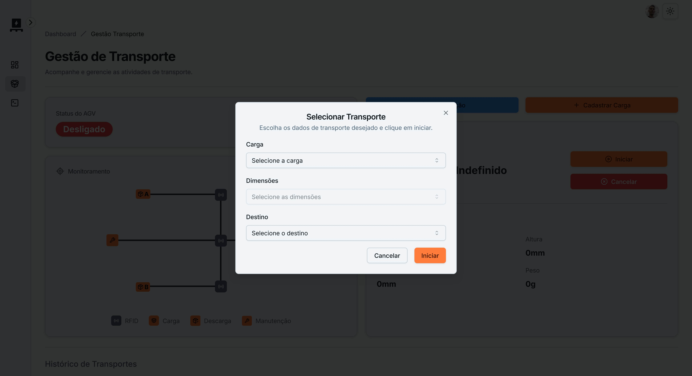

#

Figura 14. Tela de Registro de Atividades do aplicativo web

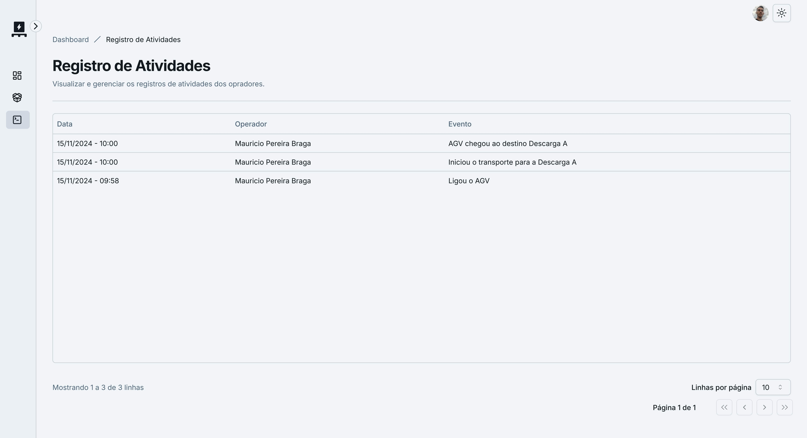
