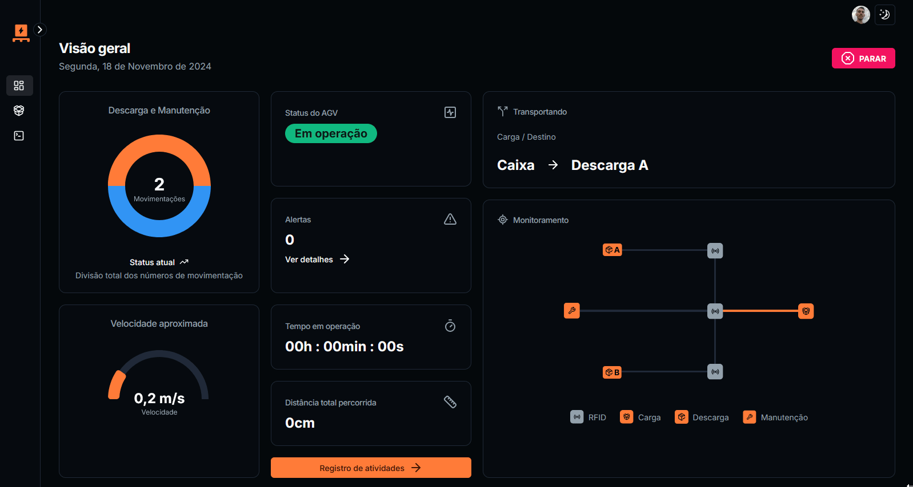
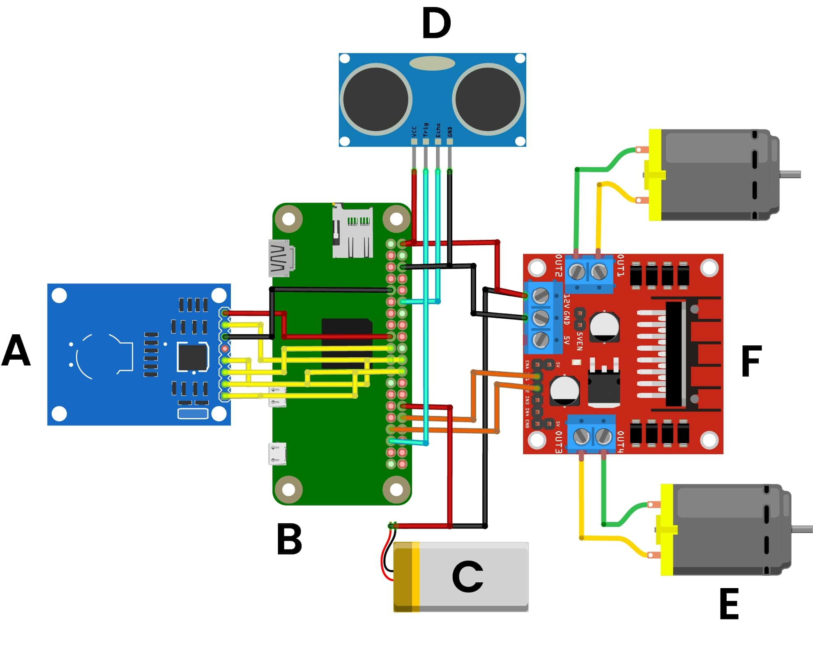

# Desenvolvimento de um Protótipo de Veículo Automatizado para Automação Logística na Indústria 4.0

Este projeto é parte do meu Trabalho Final de Graduação e visa o desenvolvimento de um Veículo Guiado Automatizado (AGV) focado em aprimorar a logística no contexto da Indústria 4.0. O AGV opera de maneira autônoma para melhorar o transporte de cargas em ambientes industriais, proporcionando eficiência, precisão e segurança na movimentação de materiais.




## 🚧 Pré-requisitos

### 👾 Tecnologias

- node v20+
- Docker

### 🏗️ Dipositivos físicos

- Raspberry Pi (computador)
- Sensor ultrasônico
- ESC brushed (Eletronic Speed Controller para motores escovados)
- Leitor RFID
- Bateria 3s (dependendo da tensão dos motores e do microcontrolador)
- Motores dc escovados
- Impressora 3D / máquinas para fabricação das peças
- Rodas de 60mm com encaixes para os motores

## 🤖 Construção do protótipo

Para construir o protótipo é necessário os arquivos. stl do projeto, os quais estão disponíveis [aqui](https://github.com/mauricioprb/tfg-agv-robo/tree/main/stl).

O processo envolve impressão 3D e envonve conhecimentos específicos para executar, além de que no projeto original foi usado, chapas de acm e mdf para confeccionar as tampas, usando router CNC e corte a laser.

### ⚡ Eletrônica

Para construir a eletrônica base deve-se seguir o esquema abaixo. Tendo em vista que a ponte H representada na verdade deve ser um ESC com regulador de tensão embutido.



## 🌐 Aplicativo Web

Para estar executando o aplicativo web é necessário ter node e Docker.

Abrindo o projeto em uma IDE/editor de texto, deve-se criar um arquivo `.env`, o qual deve ser preenchido com todas informações requisitadas como no `.env.example`. Logo após os comandos:

Instalar os pacotes

```
npm install
```

Rodar as migrations

```
npm run dev:migrate
```

Adicionar usuário a whitelist

```
npm run add:usuario
```

Adicionar AGV ao banco

```
npm run add:agv -- "usuario_id"
```

Adicionar as rotas

```
npm run popular:rotas
```

Por fim, os comandos para executar a aplicação:

```
npm run dev:docker
```

Paralelamente

```
npm run dev
```
